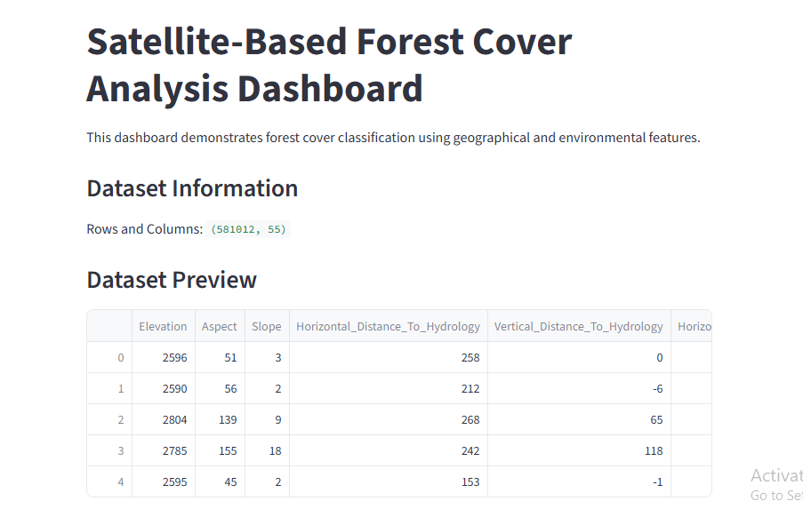
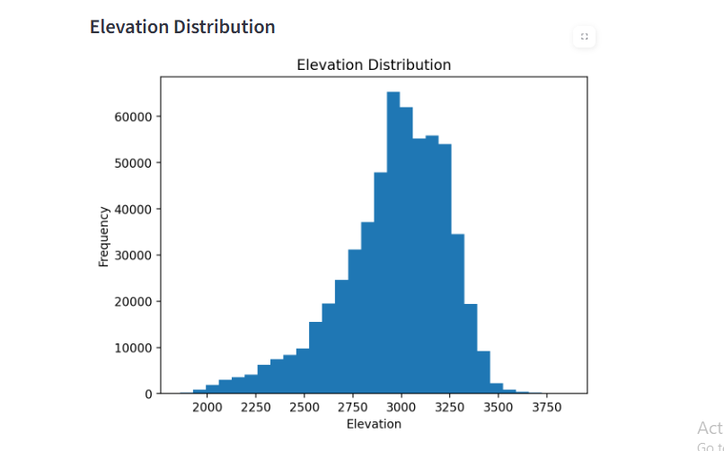
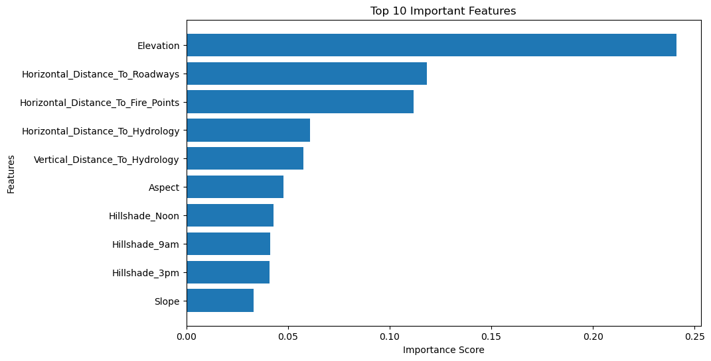

# Satellite-Based Forest Cover Analysis Dashboard

## Live Dashboard

https://sanjula2003-satellite-based-forest-cover-an-appdashboard-ymelsr.streamlit.app/

---

# Project Overview

This project demonstrates the application of Machine Learning and GIS-related environmental analysis techniques for forest cover classification using geographical and terrain-based variables.

A Random Forest classification model was developed using the Forest Cover Type dataset to classify forest cover categories based on environmental and geospatial attributes such as elevation, slope, hillshade, hydrology distance, roadway distance, and fire-point distance.

An interactive Streamlit dashboard was also developed to visualize environmental patterns, model performance, and feature importance analysis.

The project was developed as part of a GIS and Data Science portfolio focused on environmental monitoring and geospatial intelligence applications.

---

# Dashboard Screenshots

### Dashboard Overview



### Elevation Analysis



### Feature Importance Analysis



---

# Objectives

* Perform exploratory data analysis on environmental GIS datasets
* Analyze terrain and geographical variables affecting forest cover
* Build a machine learning classification model for forest cover prediction
* Identify important environmental features influencing classification
* Develop an interactive dashboard for environmental data visualization
* Demonstrate practical GIS-related analytical workflows

---

# Dataset Information

Dataset:

* Forest Cover Type Dataset

Total Records:

* 581,012

Deployment Dataset Size:

* 50,000 sample records used for cloud deployment optimization

Target Variable:

* Cover_Type

Key Features:

* Elevation
* Aspect
* Slope
* Hillshade
* Hydrology Distance
* Roadway Distance
* Fire Point Distance
* Soil Type

---

# Technologies Used

| Technology   | Purpose                             |
| ------------ | ----------------------------------- |
| Python       | Data analysis and development       |
| Pandas       | Data processing                     |
| NumPy        | Numerical computation               |
| Matplotlib   | Data visualization                  |
| Scikit-learn | Machine learning                    |
| Streamlit    | Interactive dashboard               |
| GitHub       | Version control and project hosting |

---

# Machine Learning Model

Model Used:

* Random Forest Classifier

Model Accuracy:

* 95.5%

Top Important Features:

1. Elevation
2. Horizontal Distance To Roadways
3. Horizontal Distance To Fire Points

---

# Dashboard Features

* Interactive dashboard interface
* Dataset preview and exploration
* Forest cover type distribution visualization
* Elevation distribution analysis
* Machine learning model evaluation
* Feature importance visualization

---

# Project Structure

01_Deforestation_Detection/

├── data/

├── notebooks/

├── screenshots/

├── app/

├── README.md

├── requirements.txt

└── main.py

---

# Installation Guide

## Clone Repository

```bash
git clone https://github.com/Sanjula2003/Satellite-Based-Forest-Cover-Analysis.git
```

## Install Dependencies

```bash
pip install -r requirements.txt
```

## Run Dashboard

```bash
streamlit run app/dashboard.py
```

---

# Future Improvements

* Integrate real satellite imagery datasets
* Add GIS map visualizations using Folium or GeoPandas
* Implement advanced remote sensing analysis
* Deploy deep learning models for land-cover classification
* Add real-time environmental monitoring functionality

---

# Limitations

* The deployed dashboard uses a reduced dataset sample for cloud optimization
* The current project uses a public environmental dataset rather than real-time satellite feeds
* GIS mapping layers are not yet integrated into the dashboard

---

# Conclusion

This project demonstrates how Machine Learning and GIS-related environmental datasets can be used for forest monitoring and geospatial analysis. The developed dashboard provides an interactive platform for understanding forest cover classification, environmental feature importance, and terrain-based predictive analysis.

The project also demonstrates practical skills in data science workflow development, machine learning model implementation, dashboard deployment, and technical documentation.
